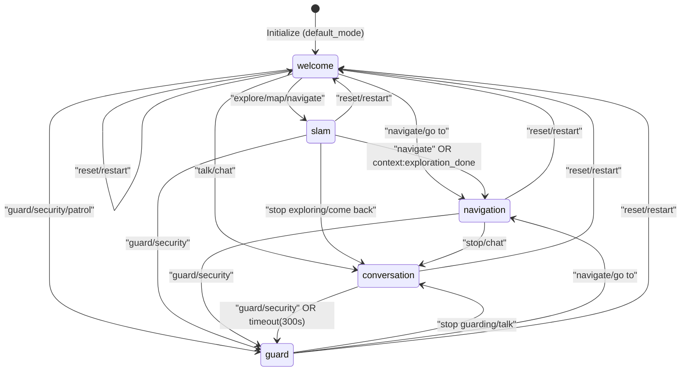
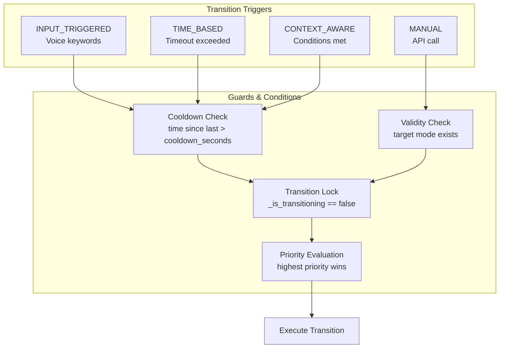
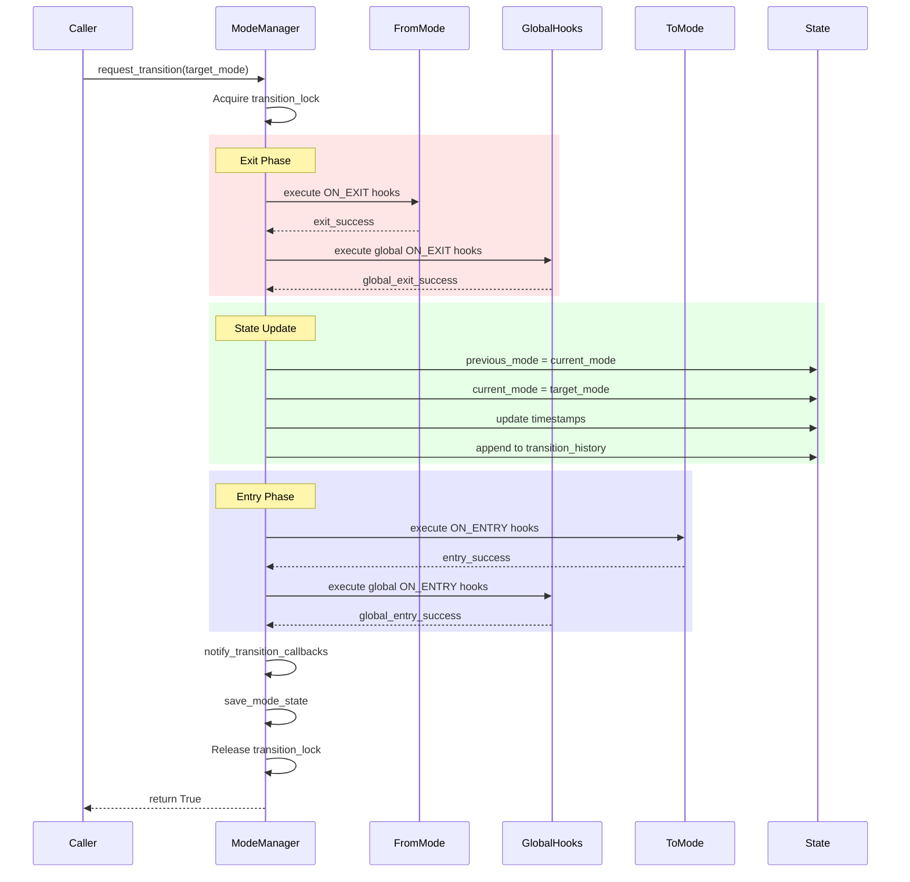
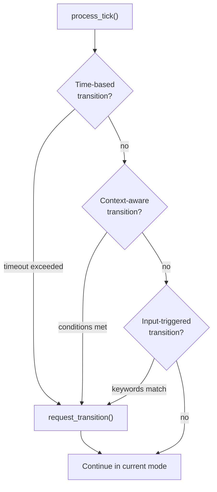
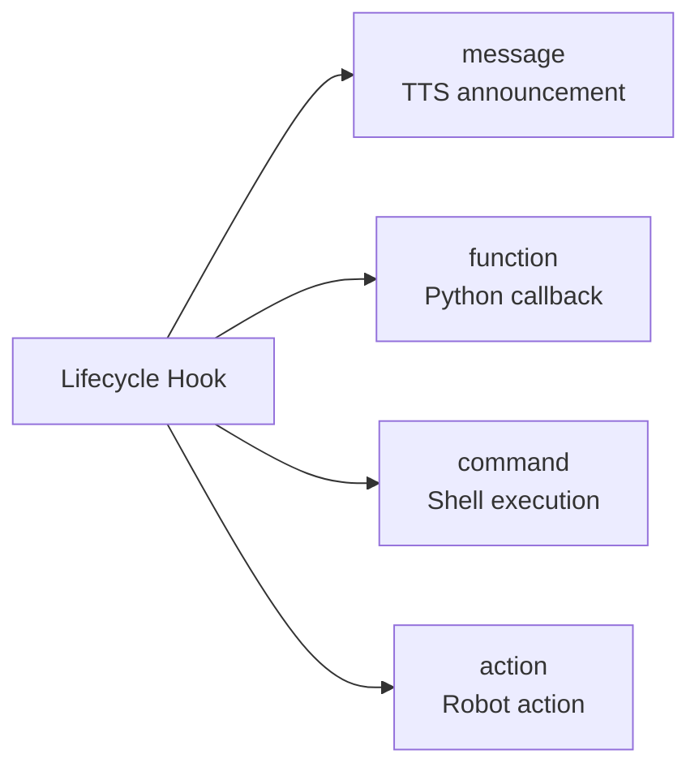

## Overview

This document provides visual diagrams for the Multi-Mode Manager state machine. For detailed explanations of modes, lifecycle, and transition rules, see the related documentation:

- [Modes](/full_autonomy_guidelines/modes.mdx) - What are modes and their descriptions
- [Lifecycle](/full_autonomy_guidelines/lifecycle.mdx) - Lifecycle stages and hooks
- [Transition Rules](/full_autonomy_guidelines/transition_rules.mdx) - How transitions work

## State Diagram

The following diagram shows all available modes and their possible transitions:

## Transition Flow

This diagram shows how transitions are evaluated and processed:

## Lifecycle Hooks Sequence

This sequence diagram shows the order of operations during a mode transition:

## Tick Processing

Every tick, the manager checks for possible transitions in this order:

## Transition Rules Summary

| From | To | Trigger | Keywords | Priority | Cooldown |
|------|-----|---------|----------|----------|----------|
| welcome | slam | INPUT | explore, map, navigate, look around | 3 | 5s |
| welcome | navigation | INPUT | navigate, go to, take me to | 3 | 5s |
| welcome | conversation | INPUT | talk, chat, tell me | 2 | 3s |
| welcome | guard | INPUT | guard, security, patrol | 4 | 10s |
| slam | navigation | INPUT/CONTEXT | navigate, exploration_done:true | 2-3 | 5s |
| slam | conversation | INPUT | stop exploring, come back | 2 | 5s |
| slam | guard | INPUT | guard, security | 3 | 10s |
| navigation | conversation | INPUT | stop, chat, talk | 2 | 5s |
| navigation | guard | INPUT | guard, security | 3 | 10s |
| conversation | guard | INPUT/TIME | guard, security OR 300s timeout | 2-3 | 10s |
| guard | conversation | INPUT | stop guarding, talk | 3 | 5s |
| guard | navigation | INPUT | navigate, go to | 2 | 5s |
| * | welcome | INPUT | reset, restart, initialize | 5 | 10s |

## Hook Handler Types

## State Persistence

The mode manager persists state across restarts:

- **File:** `/config/memory/.<config_name>.memory.json5`
- **Saved on:** Every successful transition
- **Restored on:** System startup (if `mode_memory_enabled: true`)
- **History:** Last 50 transitions (trimmed to 25 when exceeded)

## Related Files

| File | Description |
|------|-------------|
| `src/runtime/multi_mode/manager.py` | Main implementation |
| `config/unitree_go2_modes.json5` | Example configuration |
